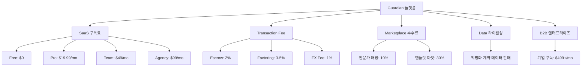
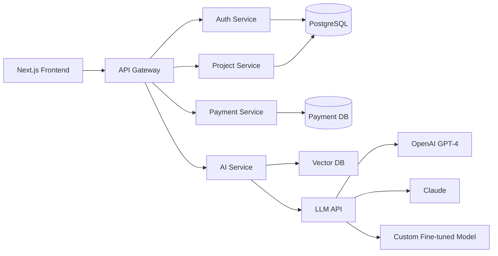
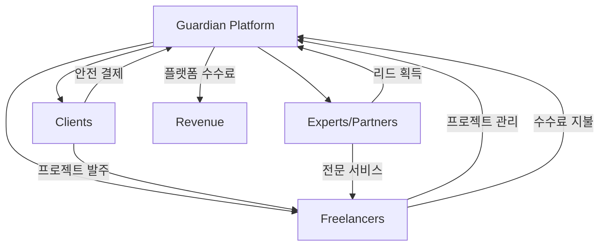

# Guardian Agency OS - 전략적 비즈니스 확장 계획서

> [!IMPORTANT]
> **전략적 목표**: 단순 업무 도구를 넘어, Solopreneur Ecosystem의 "Operating System"이자 "Financial Infrastructure"로 진화

---

## 📊 Executive Summary

**Vision**: 전 세계 프리랜서를 위한 **End-to-End Business Infrastructure Provider**  
**Mission**: 1인 기업가들이 사업에만 집중할 수 있도록, 계약부터 정산까지의 모든 리스크와 복잡성을 제거

**핵심 차별화 요소**:
1. **AI-Powered Risk Management**: 법무/재무 리스크를 AI가 사전 차단
2. **Embedded Finance**: 결제 인프라를 플랫폼 내부에 통합 (Escrow, Factoring, Credit)
3. **Network Effect**: 프리랜서-클라이언트-전문가를 연결하는 3-sided marketplace

---

## 1. 경쟁 환경 분석 (Competitive Landscape)

### 1.1 주요 경쟁사 & 차별화 포인트

| 경쟁사 | 강점 | 약점 | Guardian의 차별화 |
|--------|------|------|-------------------|
| **Notion** | 유연한 워크스페이스 | 프리랜서 특화 기능 없음 | 계약서 AI 분석, 결제 연동 |
| **Bonsai/HoneyBook** | 미국 시장 점유율 높음 | 글로벌화 부족, 한국 법규 미지원 | 다국가 법무 DB, 다통화 지원 |
| **Monday.com** | 강력한 프로젝트 관리 | B2B 중심, 1인 기업 UX 복잡 | Solopreneur 맞춤 간결한 UI |
| **Upwork/Fiverr** | 클라이언트 매칭 | 높은 수수료(20%), 의존성 | 자체 클라이언트 유지 가능 |

**Guardian의 Moat (경쟁 우위)**:
- **법무 AI 데이터**: 국가별/산업별 계약서 독소 조항 DB → 축적된 데이터가 진입장벽
- **결제 인프라**: Stripe 같은 단순 연동이 아닌, Escrow Logic 자체 보유
- **에이전트 생태계**: PM/디자이너/개발자/QA/법무 역할 분리 → 타사 모방 어려움

### 1.2 TAM (Total Addressable Market)

- **글로벌 프리랜서 시장 규모**: $1.5T (2026년 기준)
- **타겟 세그먼트**: 연 수익 $50K 이상 프리랜서 (약 3,000만 명)
- **예상 침투율 (3년 내)**: 0.1% → **30만 유료 사용자**
- **계산된 ARR**: 30만 명 × $200/year = **$60M ARR**

---

## 2. 서비스 확장 로드맵 (Product Roadmap)

### Phase 1: Core OS (0-12개월) - "Freelancer's OS"
**목표**: Notion + Bonsai를 대체할 수 있는 올인원 워크스페이스

| 기능 | 설명 | 수익화 방식 |
|------|------|-------------|
| **Dashboard** | 매출/프로젝트/일정 통합 뷰 | Freemium (기본 제공) |
| **Project Kanban** | Trello 수준의 간단한 작업 관리 | Freemium |
| **Client CRM** | 연락처 + 계약 이력 관리 | Freemium (10명 제한) |
| **Invoice Generator** | PDF 견적서/청구서 자동 생성 | Pro ($9.99/mo) |
| **Time Tracking** | 프로젝트별 시간 추적 및 보고서 | Pro |

### Phase 2: Guardian Layer (12-24개월) - "Safety Net"
**목표**: 법적/금전적 리스크를 AI로 제거 → 프리미엄 브랜드 구축

| 기능 | 설명 | 수익화 방식 |
|------|------|-------------|
| **AI Contract Analyzer** | 계약서 업로드 시 독소조항 탐지 | Pro ($19.99/mo, 월 5건) |
| **Legal Template Library** | 산업별 표준 계약서 200+ | Pro |
| **Escrow Payment** | 마일스톤 기반 안전 결제 | 거래액의 2% 수수료 |
| **Auto-Negotiation Assistant** | GPT 기반 이메일 협상 초안 작성 | Pro |
| **Insurance Partnership** | 프로젝트 배상책임보험 연동 | 보험사 제휴 수수료 |

### Phase 3: Agency Enabler (24-36개월) - "Scale-Up Infrastructure"
**목표**: 1인 → 소규모 에이전시 전환 지원

| 기능 | 설명 | 수익화 방식 |
|------|------|-------------|
| **Team Collaboration** | 다른 프리랜서와 협업 (Slack 대체) | Team Plan ($49/mo) |
| **Revenue Sharing Engine** | 프로젝트 수익 자동 배분 | Team Plan |
| **White-label Portal** | 클라이언트 전용 브랜딩 페이지 | Agency Plan ($99/mo) |
| **API Access** | 자체 시스템 연동 | Enterprise |

---

## 3. 비즈니스 모델 Deep Dive

### 3.1 다층 수익 구조 (Multi-layered Revenue)



### 3.2 Unit Economics (단위 경제학)

**Pro 플랜 기준**:
- **ARPU** (Average Revenue Per User): $20/mo
- **CAC** (Customer Acquisition Cost): $60 (Paid Ads + Content Marketing)
- **Payback Period**: 3개월
- **LTV** (Lifetime Value): $20 × 36개월 × 70% retention = **$504**
- **LTV/CAC Ratio**: 8.4x ✅ (건강한 비즈니스)

**거래 수수료 기준** (Escrow 이용자):
- **평균 프로젝트 규모**: $5,000
- **수수료율**: 2% = **$100/건**
- **연간 프로젝트 수 (활성 유저)**: 10건
- **연간 수수료 수익**: $1,000/user

**Total ARPU (하이브리드 수익)**:  
$240 (구독) + $1,000 (수수료) = **$1,240/year**

### 3.3 핵심 수익원별 전략

#### 💳 A. SaaS Subscription (안정적 현금흐름)
- **Free Plan**: 입문 장벽 제거, 바이럴 유도 (SNS 공유 시 추가 저장공간)
- **Pro Plan**: AI 기능(Contract Review, Negotiation) 언락 → 핵심 전환 드라이버
- **Team/Agency Plan**: 협업 시트 수 무제한, 화이트라벨 제공

#### 💰 B. Transaction Fees (고수익)
- **Escrow Service**:
  - 결제 대행업 라이센스 취득 또는 PG사와 제휴
  - 분쟁 시 중재 서비스 제공 (수수료 업셀)
- **Invoice Factoring** (선정산):
  - 청구서 발행 후 즉시 80% 선지급 → 잔금은 클라이언트 결제 시
  - 연 18% 이자율 적용 (3-5% 수수료 환산)
  - **Target**: 현금 흐름 문제를 겪는 프리랜서 20%

#### 🏪 C. Marketplace Economy
1. **Expert Network**: 세무사/변호사/디자이너 등 전문가 풀 구축
   - 플랫폼 내 "Ask an Expert" 기능
   - 건당 컨설팅 비용의 10% 중개 수수료
2. **Template Marketplace**:
   - 프리랜서들이 자신의 계약서/제안서 템플릿 판매
   - Guardian은 30% 수수료 (Gumroad 모델)

#### 📊 D. Data Monetization (장기 전략)
- **익명화된 계약 데이터**를 HR Tech 기업, 법무법인에 판매
  - 예: "디자이너의 평균 시급 by 지역/경력"
  - B2B 라이센싱: $50K-$200K/year per client

---

## 4. 기술 인프라 & AI 전략

### 4.1 Tech Stack Evolution

**현재 (MVP)**:
- Frontend: Next.js + React
- Backend: Next.js API Routes
- Database: (To be decided - PostgreSQL 추천)

**확장 시 (Scale-Up)**:


**Key Infrastructure Decisions**:
1. **Microservices vs Monolith**: 초기 Monolith → 100K users 이후 분리
2. **Payment Infrastructure**:
   - Stripe Connect (Escrow 구현)
   - Wise API (해외 송금)
   - Toss Payments (국내)
3. **AI Model Strategy**:
   - Phase 1: OpenAI API (빠른 출시)
   - Phase 2: Fine-tuning (계약서 데이터 학습)
   - Phase 3: Self-hosted LLM (비용 절감)

### 4.2 AI Agent 아키텍처

```typescript
// Guardian AI Agent System
interface GuardianAgent {
  planner: PlannerAgent;      // 기획 및 전략
  designer: DesignerAgent;    // UI/UX 설계
  developer: DeveloperAgent;  // 코드 구현
  qa: QAAgent;                // 품질 검증
  legal: LegalAgent;          // 법무 검토
  financial: FinancialAgent;  // 재무 분석 (NEW)
}

// 신규 에이전트: Financial Agent
class FinancialAgent {
  analyzeCashFlow(projects: Project[]): CashFlowReport;
  detectAnomalies(invoices: Invoice[]): Alert[];
  suggestPricing(industry: string, scope: string): PriceRange;
  taxOptimization(revenue: number, expenses: Expense[]): TaxStrategy;
}
```

**AI 차별화 전략**:
- **Industry-specific Models**: 업종별 계약서 학습 (IT, 디자인, 마케팅 etc.)
- **Multilingual Support**: 한국어, 영어, 일본어, 중국어 동시 지원
- **Context-aware Negotiation**: 과거 대화 이력 기반 협상 전략 제시

---

## 5. 생태계 & 파트너십 전략

### 5.1 Three-Sided Platform



### 5.2 전략적 파트너십

| 파트너 유형 | 파트너 예시 | 협업 내용 | Guardian 혜택 |
|------------|-----------|----------|--------------|
| **금융사** | 신한은행, KB카드 | 법인카드, 사업자대출 연동 | 이자 수익 분배 |
| **법무법인** | 법무법인 광장 | 계약서 검토 서비스 제휴 | 화이트라벨 제공 |
| **회계사무소** | 세무법인 밝은 | 세금 신고 대행 | 건당 수수료 |
| **보험사** | 삼성화재 | 프로젝트 배상책임보험 | 보험료 10% 수수료 |
| **교육 플랫폼** | 인프런, 클래스101 | 프리랜서 교육 코스 | 수강생 유입 |
| **공간 대여** | WeWork, 패스트파이브 | 회원 할인 제휴 | 브랜드 제휴비 |

### 5.3 Developer Ecosystem (API Economy)

**Guardian API Marketplace**:
- 써드파티 개발자가 Guardian 위에 앱/플러그인 개발 가능
- 예시:
  - "Instagram DM → Guardian Project 자동 생성"
  - "Guardian Invoice → 회계 프로그램 자동 전송"
- 수익 배분: 개발자 70% / Guardian 30%

**개발자 지원 프로그램**:
- API 문서 + SDK (JavaScript, Python)
- 월 $1M revenue 달성 시 Accelerator 프로그램 운영

---

## 6. Go-to-Market (GTM) 전략

### 6.1 Acquisition Channels

| 채널 | 전략 | 예상 CAC | 전환율 |
|------|------|---------|--------|
| **SEO/Content** | "프리랜서 계약서 양식" 등 롱테일 키워드 | $20 | 5% |
| **YouTube** | "프리랜서 세금 신고 가이드" 영상 | $30 | 8% |
| **커뮤니티** | 디스콰이엇, 프리랜서 오픈카톡방 | $10 | 3% |
| **Referral** | 친구 초대 시 1개월 무료 | $15 | 12% |
| **Paid Ads** | Google/Meta 광고 | $80 | 2% |

**Initial Wedge (초기 진입점)**:
1. **무료 계약서 생성기** → 바이럴 유도
2. **"계약서 위험도 진단" AI 챗봇** → 리드 수집
3. **프리랜서 커뮤니티 스폰서십** (밋업, 컨퍼런스)

### 6.2 Growth Hacking Tactics

**Viral Loop 설계**:
```
1. 프리랜서 A가 견적서를 Guardian으로 생성
2. 클라이언트 B가 견적서를 받음 (하단에 "Powered by Guardian" 워터마크)
3. 클라이언트 B가 "승인" 버튼 클릭 → Guardian 가입 유도
4. 클라이언트 B도 다른 프리랜서와 일할 때 Guardian 사용
→ Network Effect 발생
```

**Cold Start Problem 해결**:
- **공급측(프리랜서)**: 초기 100명에게 무료 Pro 플랜 6개월 제공
- **수요측(클라이언트)**: 프리랜서가 초대 링크 발송 시 자동 가입

### 6.3 지역별 확장 전략

**Phase 1 (Year 1)**: 🇰🇷 한국 시장 장악
- 한국 프리랜서 약 200만 명 (통계청 2025)
- 목표: 1% 점유율 = 2만 명 유료 사용자

**Phase 2 (Year 2)**: 🇯🇵 일본 + 🇺🇸 미국 (거주 한국인)
- 일본: 언어/문화 유사성, 프리랜서 시장 규모 큼
- 미국: K-디자이너/개발자 커뮤니티 공략

**Phase 3 (Year 3)**: 🌏 동남아시아 (베트남, 필리핀)
- 저임금 프리랜서 시장 → 낮은 가격 정책 ($4.99/mo)
- 글로벌 클라이언트 ↔ 동남아 프리랜서 매칭

---

## 7. B2B Expansion (Enterprise Play)

### 7.1 "Guardian for Teams" - 기업용 버전

**Target 고객**:
- 프리랜서를 자주 고용하는 중소기업 (마케팅 대행사, 스타트업)
- HR 부서에서 외주 인력 관리

**기능 차별화**:
| 기능 | B2C (프리랜서) | B2B (기업) |
|------|---------------|-----------|
| 관리 대상 | 내 프로젝트 | 다수 프리랜서 관리 |
| 계약서 관리 | 내가 받는 계약서 | 내가 발주하는 표준 계약서 |
| 결제 | 내가 받는 돈 | 내가 지급하는 돈 (자동 원천징수) |
| 가격 | $19.99/mo | $499/mo (20명까지) |

**Sales Motion**:
- **Inbound**: 프리랜서들이 "우리 회사도 Guardian 쓰게 해달라" 요청 (Bottom-up)
- **Outbound**: HR Tech 컨퍼런스 참여, LinkedIn Sales Navigator

### 7.2 White-label Licensing

**타겟**: 은행, 카드사, 통신사
- 예: "신한 프리랜서 플랫폼" (실제론 Guardian 기술)
- 연간 라이센스 비용: $500K-$2M
- Upside: 대량 사용자 확보 / Downside: 브랜드 희석

---

## 8. 데이터 기반 의사결정

### 8.1 핵심 KPI 추적

**North Star Metric**: **월간 활성 프로젝트 수 (Active Projects/Month)**

| KPI | 정의 | 목표 (Year 1) |
|-----|------|---------------|
| **MAU** | Monthly Active Users | 50,000 |
| **Paid Conversion** | Free → Pro 전환율 | 8% |
| **Churn Rate** | 월간 이탈률 | <5% |
| **NPS** | Net Promoter Score | >50 |
| **GMV** | Gross Merchandise Value (거래액) | $10M |

### 8.2 A/B Testing Roadmap

**지속적 실험 영역**:
1. **Pricing**: $19.99 vs $24.99 vs $14.99
2. **Onboarding Flow**: 5단계 vs 3단계 vs 프로그레시브 온보딩
3. **Freemium Limits**: 프로젝트 3개 vs 5개 무료 제공
4. **Email Campaigns**: 계약서 리마인더 발송 타이밍

---

## 9. 재무 계획 (Financial Projections)

### 9.1 3개년 매출 예측

| 항목 | Year 1 | Year 2 | Year 3 |
|------|--------|--------|--------|
| **사용자 수** | 20,000 | 100,000 | 300,000 |
| **유료 전환율** | 5% | 8% | 10% |
| **유료 사용자** | 1,000 | 8,000 | 30,000 |
| **ARPU** | $240 | $300 | $400 |
| **SaaS 매출** | $240K | $2.4M | $12M |
| **거래 수수료** | $100K | $1.5M | $8M |
| **총 매출** | **$340K** | **$3.9M** | **$20M** |

### 9.2 비용 구조

| 비용 항목 | Year 1 | Year 2 | Year 3 |
|----------|--------|--------|--------|
| **인건비** | $200K | $1.2M | $5M |
| **서버/인프라** | $30K | $150K | $800K |
| **마케팅** | $100K | $800K | $4M |
| **운영비** | $50K | $200K | $1M |
| **총 비용** | **$380K** | **$2.35M** | **$10.8M** |
| **손익** | **-$40K** | **+$1.55M** | **+$9.2M** |

**Break-even Point**: Year 2 Q2 (18개월)

### 9.3 투자 유치 전략

**Seed Round**: $500K (Year 0)
- 용도: MVP 개발 + 초기 마케팅
- Valuation: $3M (pre-money)

**Series A**: $5M (Year 2)
- 용도: 팀 확장 + 일본 진출
- Valuation: $25M (pre-money)

**Series B**: $20M (Year 3)
- 용도: 미국 진출 + M&A
- Valuation: $100M (pre-money)

---

## 10. 리스크 관리 & 법적 컴플라이언스

### 10.1 Critical Risks

| 리스크 | 영향도 | 대응 전략 |
|--------|--------|----------|
| **법무팀 에이전트의 법률 자문 규제** | High | "정보 제공" 명시, 변호사 감수 추가 |
| **결제 라이센스 이슈** | Critical | PG사 제휴 또는 금융위 승인 추진 |
| **AI 환각(Hallucination)으로 인한 오진단** | High | 사용자 동의서 + 책임 면책 조항 |
| **경쟁사의 모방** | Medium | 특허 출원 (AI 계약 분석 알고리즘) |
| **데이터 유출** | Critical | SOC 2 인증, GDPR 준수 |

### 10.2 Legal Compliance Checklist

- [ ] **개인정보보호법**: 동의서 수집, 데이터 암호화
- [ ] **전자금융거래법**: 본인인증, 거래 기록 5년 보관
- [ ] **전자서명법**: 계약서 전자서명 법적 효력 확보
- [ ] **소득세법**: 원천징수 자동 계산 및 신고 연동
- [ ] **변호사법**: AI 법률 자문의 한계 명시
- [ ] **약관규제법**: 약관 심사 필요 여부 검토

---

## 11. 성공 시나리오 & Exit Strategy

### 11.1 성공 지표

**5년 내 목표**:
- 📊 **ARR $50M** 달성
- 👥 **100만 사용자** (전 세계)
- 🌏 **10개국 진출**
- 💰 **Valuation $500M** (유니콘 근접)

### 11.2 Exit Options

1. **IPO** (가장 이상적)
   - KOSDAQ 또는 NASDAQ 상장
   - 비교 기업: Monday.com (Valuation $9B), HubSpot ($20B)

2. **M&A**
   - **잠재적 인수자**: Atlassian, Adobe, Salesforce, Intuit
   - 예상 인수가: $300M-$1B (ARR의 15-20배)

3. **전략적 파트너십**
   - 대형 은행/카드사에 지분 매각 (지배구조 유지)

---

## 12. 실행 우선순위 (Next Steps)

### 🎯 Immediate (0-3개월)
- [x] MVP 기본 기능 완성 (Dashboard, Project, CRM)
- [ ] AI Contract Review β 버전 출시
- [ ] 초기 100명 사용자 확보 (커뮤니티 공략)
- [ ] Stripe Connect 연동 (Escrow 준비)

### 🚀 Short-term (3-6개월)
- [ ] Pro 플랜 유료화 시작
- [ ] 법무법인/세무사 파트너십 1건 확보
- [ ] 프리랜서 커뮤니티 스폰서십 (3건)
- [ ] SEO 콘텐츠 50개 발행

### 🌟 Mid-term (6-12개월)
- [ ] Escrow Payment 정식 론칭
- [ ] 일본어 버전 출시
- [ ] Series A 투자 유치 ($3-5M)
- [ ] 팀 확장 (개발 3명, 마케팅 2명)

### 🏆 Long-term (12-24개월)
- [ ] B2B 엔터프라이즈 제품 출시
- [ ] API Marketplace 오픈
- [ ] 미국 법인 설립
- [ ] Break-even 달성

---

**작성자**: 📋 Planner (Guardian Agent Team)  
**검토자**: ⚖️ Legal Compliance Team  
**승인일**: 2026-02-10  
**다음 리뷰**: 2026-05-10 (분기별 업데이트)
